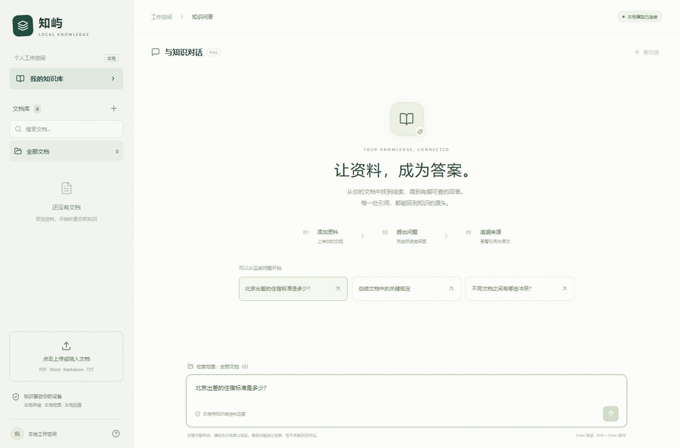
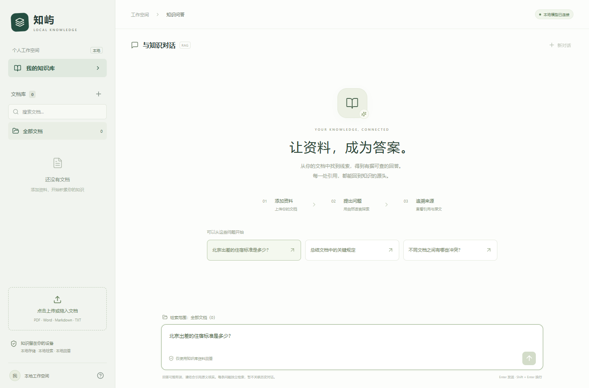
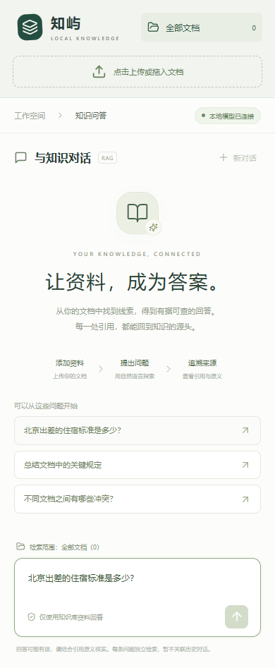

# KnowIsland (知屿) — Local Private RAG Knowledge Base

[](https://www.python.org/)
[](https://fastapi.tiangolo.com/)
[](https://react.dev/)
[](LICENSE)
[](https://github.com/toyhank/private-knowledge-base/actions/workflows/static.yml)


[English](README.md) · [简体中文](README_zh-CN.md)

**A local-first RAG app for PDF, DOCX, Markdown and TXT with clickable source citations, BGE-M3 retrieval + reranking, Qdrant, Ollama-compatible local LLMs, and a React UI.**

No LangChain. No mandatory cloud API. No mystery citation IDs.

> Built for people who want to inspect the whole RAG pipeline and run it on consumer hardware — including an 8GB GPU setup.

<p align="center">
  
</p>

## Why this repo?

There are many RAG demos. This one focuses on a smaller set of things that are easy to verify:

- 🔒 **Local-first by default** — documents, embeddings, vector index and metadata stay on your machine.
- 🔗 **Real source citations** — answers point back to the actual retrieved chunk, filename, section and PDF page when available.
- 🛑 **Abstains when evidence is weak** — empty / low-confidence retrieval can skip LLM generation instead of inventing an answer.
- 🧠 **BGE-M3 + reranker** — dense retrieval followed by BGE reranking before generation.
- ⚙️ **No LangChain / agent framework** — ingestion, retrieval, reranking, context budgeting and citation validation are explicit Python code.
- 💻 **Consumer-GPU friendly** — embeddings/reranker can stay on CPU while the local LLM uses the GPU; the current setup targets 8GB VRAM.
- 🧪 **Reproducible tests** — API, parser, chunking, pipeline and local-model smoke tests are included.
- 📱 **Responsive React UI** — desktop and mobile layouts, document scoping and clickable citation details.

## 60-second tour

1. Upload a PDF / Word / Markdown / TXT file.
2. The document is parsed, chunked and indexed with BGE-M3.
3. Ask a question.
4. Top candidates are reranked.
5. Only selected chunks enter the LLM context.
6. The answer returns with clickable citations to the original chunks.
7. If the knowledge base does not contain enough evidence, the system can refuse instead of hallucinating.

```text
Upload → parse → structured chunks → BGE-M3 → Qdrant

Question → BGE-M3 → Top 30 → BGE reranker
         → threshold filter → Top 5 → context budget
         → local LLM → citation validation → answer + sources
```

## Quick start

Requirements:

- Python 3.12
- Node.js 22+
- [uv](https://docs.astral.sh/uv/)
- [Ollama](https://ollama.com/)

### Windows

```powershell
git clone https://github.com/toyhank/private-knowledge-base.git
cd private-knowledge-base
.\scripts\setup.ps1
.\scripts\start.ps1
```

### Linux / macOS

```bash
git clone https://github.com/toyhank/private-knowledge-base.git
cd private-knowledge-base
chmod +x scripts/setup.sh scripts/start.sh
./scripts/setup.sh
./scripts/start.sh
```

The setup script creates the Python environment, copies `.env.example` when needed,
downloads the local BGE models, installs/builds the frontend, and prepares the default
Qwen model in Ollama.

Use `--skip-models` / `--skip-llm` on Linux or `-SkipModels` / `-SkipLlm`
on Windows when those pieces are already installed.

Open **http://127.0.0.1:8000**.

## Try the built-in example

Upload:

```text
samples/公司测试制度.md
```

Ask:

> 北京出差的住宿标准是多少？

Expected answer: **600 RMB per person per night**, with a clickable citation.

Then ask:

> 公司的火星基地地址是什么？

The knowledge base should report that it does not have sufficient information instead of fabricating an address.

## Stack

| Layer | Choice |
|---|---|
| UI | React + Vite |
| API | FastAPI |
| Metadata | SQLite |
| Vector store | Qdrant |
| Embedding | BAAI BGE-M3 |
| Reranker | BGE reranker v2-m3 |
| LLM | Ollama / OpenAI-compatible local endpoint |
| Supported docs | PDF, DOCX, Markdown, TXT |
| Default deployment | Single-user, single-machine |

## 8GB VRAM setup

The default strategy keeps **embedding and reranking on CPU** and reserves GPU VRAM for the quantized local LLM.

This does **not** mean every model fits into 8GB simultaneously. Actual memory use depends on quantization, context length, model size and other GPU processes.

A practical setup is:

- 8GB NVIDIA GPU
- 32GB system RAM
- quantized 4B–8B local LLM
- CPU BGE-M3 + reranker
- 4096–8192 token LLM context

The local configuration has been exercised with Qwen3.5 4B / 9B variants. Model choice is isolated from the RAG pipeline.

## Source-grounded answers

Citation metadata comes from the actual selected chunks.

The backend validates citation indices so an answer cannot reference a source number that was never provided to the model. PDF chunks retain physical page numbers; DOCX does not invent page numbers.

A correct citation index still does not mathematically prove every sentence is supported by the source, so important answers should still be checked against the cited text.

## Local-first privacy model

By default:

- uploaded documents remain local;
- SQLite metadata remains local;
- Qdrant remains local;
- BGE models run locally;
- the LLM endpoint is expected to be local/private.

Remote LLM endpoints are blocked by default. If you explicitly enable `ALLOW_REMOTE_ENDPOINTS=true`, retrieved source text may be sent to that endpoint.

## UI

Desktop:

<p align="center">
  
</p>

Mobile:

<p align="center">
  
</p>

## API

| Endpoint | Purpose |
|---|---|
| `POST /api/documents/upload` | Upload a document |
| `GET /api/documents` | List documents and states |
| `GET /api/documents/{id}` | Document details |
| `GET /api/documents/{id}/chunks` | Inspect original chunks |
| `POST /api/documents/{id}/retry` | Retry failed ingestion |
| `DELETE /api/documents/{id}` | Remove file, metadata and vectors |
| `POST /api/chat` | Ask a grounded question |
| `GET /api/health` | Check LLM and model status |

## Reproducible benchmark

With KnowIsland running locally:

```powershell
.\.venv\Scripts\python.exe scripts\benchmark.py
```

The benchmark uploads the synthetic sample policy, runs 10 deterministic questions,
checks answer facts, verifies that positive answers include supporting source text,
checks refusal behavior for unsupported questions, records API latency, and writes:

```text
benchmark/results/latest.json
benchmark/results/latest.md
```

This deliberately reports **end-to-end grounded-answer behavior**, not an invented
Recall@K number. The benchmark dataset is versioned in
`benchmark/company_policy.jsonl`, so anyone can reproduce or extend it.

## Run the tests

```powershell
.\.venv\Scripts\python.exe -m pytest -q
.\.venv\Scripts\ruff.exe check backend tests scripts
npm.cmd run build --prefix frontend
```

With local BGE models and Ollama running:

```powershell
.\.venv\Scripts\python.exe scripts\smoke_test.py
```

## Current scope

KnowIsland is intentionally a **single-machine, single-process, single-user** project today.

Not yet included:

- OCR for scanned PDFs
- multi-user authentication / ACLs
- multi-turn memory
- hybrid BM25 + dense retrieval
- distributed job queues
- production internet-facing deployment

That boundary is intentional: the current codebase stays small enough to read and modify.

## Roadmap

The highest-value next steps are:

- [x] versioned end-to-end evaluation dataset + reproducible grounded-answer metrics
- [x] one-command Windows / Linux setup scripts
- [ ] BM25 / sparse + dense hybrid retrieval with RRF
- [ ] OCR for scanned PDFs and images
- [ ] better table / multi-column PDF parsing
- [ ] persistent multi-turn conversations
- [ ] multi-user permissions
- [ ] standalone desktop packaging

## Project structure

```text
backend/          FastAPI + RAG pipeline
frontend/         React UI
scripts/          startup, model download and smoke tests
samples/          reproducible sample documents
tests/            parser, API and pipeline tests
compose.yaml      optional Qdrant / backend deployment
```

The core pipeline is intentionally split into small services for document ingestion, embeddings, vector search, reranking, LLM access and grounded-answer assembly.

## Chinese documentation

For detailed Windows setup, CUDA notes, operational limits and implementation details, see:

**[README_zh-CN.md](README_zh-CN.md)**

## Contributing

Issues and PRs are welcome, especially for:

- retrieval evaluation;
- hybrid search;
- PDF parsing;
- lower-memory local inference;
- additional OpenAI-compatible local model servers.

If the project is useful to you, a ⭐ makes it easier for other people looking for a small, inspectable local RAG stack to find it.

## License

MIT
